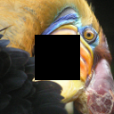
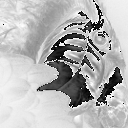

# Image Manipulation

This was a code that I learnt in my machine learning class to be able to manipulate figures in terms of the colour including the colour scaling.
As a reference, shown below this was the original image.

<!---<figure align = "center">

<figcaption align = "center"><b>Original Image</b></figcaption>
</figure> -->

Original

In the first image shown below, I was able to change the colour of a rectangle in the middle to black, showing a black rectangle in the middle.

Image with the black rectangle

In the next image, the image was changed from the original colour to greyscale, changing all teh colour pixels to black or white depending on the hex code conditions.

Original

